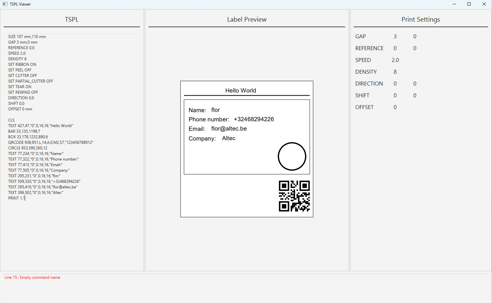

# TSPL Viewer

A JavaFX application for previewing TSPL code.

## Description

TSPL Viewer is a ligtweight JavaFX application that allows users to preview TSPL printer code in real-time. It supports custom label previews, making it easy to test label layouts before printing.

## Features
- Real-time TSPL code preview
- Label preview om canvas
- TSPL validation with error's

## Installation

### Prerequisites
- Java 17 or higher (build on Java 25 SDK)
- Maven or gradle (Gradle used in the project)

### Steps 

1. Clone the repsitory
```bash
git clone https://github.com/xMelow/TSPL-Viewer
```
2. Open the project in your IDE (Intellij)
3. Build and run the application

## Usage

1. Open the application
2. Enter TSPL code in the left panel
3. View the label preview in the center
4. View the error's shown on the bottom

